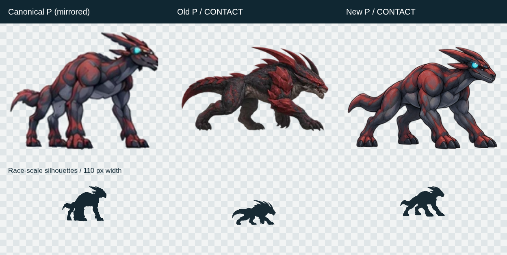
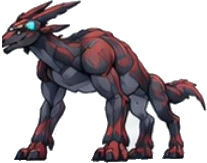
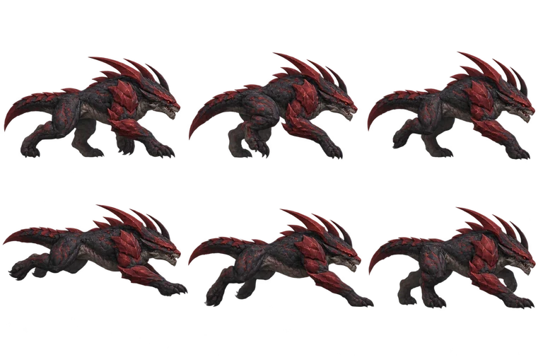
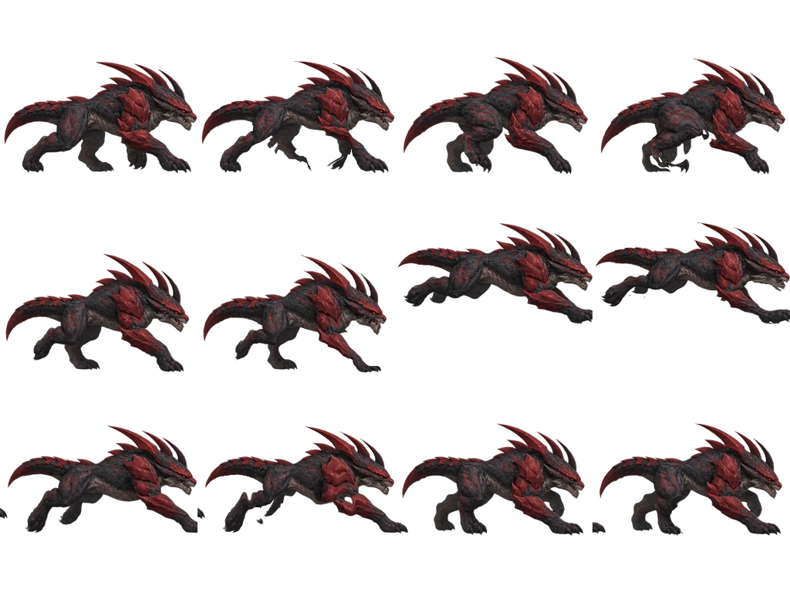
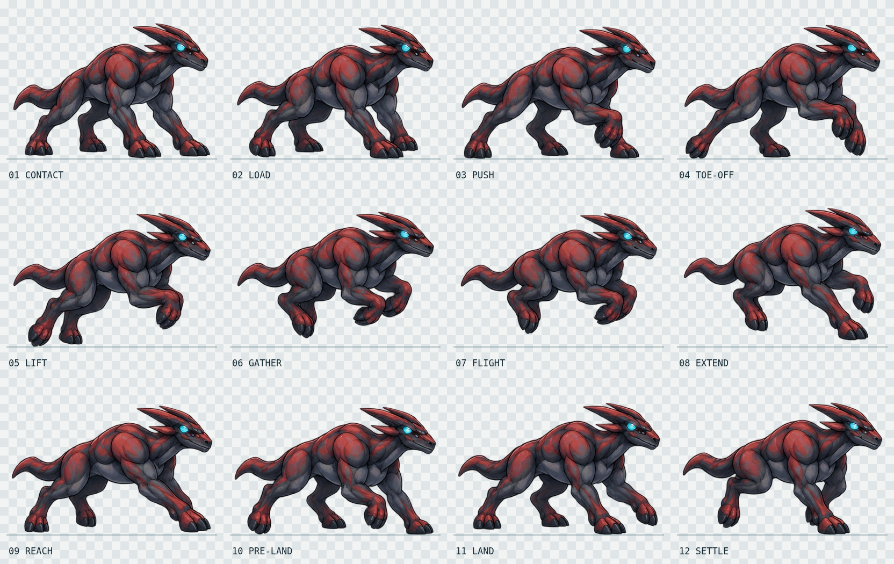
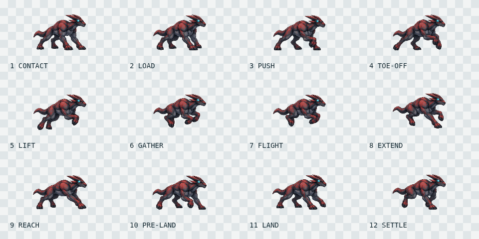

# Canonical P run-sheet correction — 2026-10-11

**Decision: KEEP as a substantial canonical-identity correction and a readable 12-pose replacement.** This is not a claim of exact reference reproduction or a fully polished gait. The remaining shape and motion differences below are visible and retained in the evidence.

Scope: existing 2.5D `race-quality.html` only, on `fix/2p5d-p-canonical-20261011`, based on `cde1bd7c8a26637d587aafd6d1d8cc4da8fb0315`. P's run artwork and its decoding/anchoring change. The canonical references, S/E/A artwork and animation, race simulation, and other implementation lanes do not change. The user explicitly requested P-only integration; this takes precedence over the lock document's older P/E/A group-promotion order.

## Canonical, old, new



The three comparison columns use approximately equal full-creature widths, with their original aspect ratios. Canonical P is mirrored **for comparison only**. The original source remains untouched. The source concept is only 207×163 pixels; enlarging it does not add anatomical information. The full reference sheet is also small (516×540), so fine markings cannot be recovered with certainty.

Canonical P:



[Repository-wide canonical species sheet](references/evowild-creature-reference-sheet-20260921.jpg) · [Canonical reference lock](2p5d-creature-reference-lock.md) · [Reference index](creature-reference-index-v0.1.md)

Old production sheet (unaltered archive):



New production sheet:



## Body-part review

| Part | Canonical P | Old run sheet | New run sheet and remaining difference |
| --- | --- | --- | --- |
| Overall silhouette | High, heavy chest; powerful limbs; compact head and short tail | Long, low, spiky creature with a large head and armored tail | Restores the tall shoulder/limb relationship and compact species silhouette. Running stance is still longer and lower than the static concept. **Closer.** |
| Head / muzzle | Small, narrow, dark angular face; restrained facial detail | Large dragon-like snout with exposed teeth and a heavy brow | Compact closed muzzle, no exposed teeth, familiar angular face. Muzzle is a little smoother/rounder than the source. **Closer.** |
| Crest | Flattened swept-back red extensions aligned with the head | Tall jagged horns and large spines | Flattened rearward blades match the source family. Their tips and separation still vary slightly across poses; some look too pointed. **Closer.** |
| Neck | Short muscular connection into the high chest | Low horizontal reptilian neck | Restored sloping muscular neck. The new neck/head carriage is slightly more upright in some poses. **Closer.** |
| Shoulder / chest | Rounded red muscle compartments over slate understructure; deep chest | Jagged overlapping red shoulder plates on a scaly torso | Large rounded deltoid/chest masses, continuous smooth red/slate segments, no added armor. New belly is a little more tapered and the trunk slightly stretched. **Much closer.** |
| Back / flank | Smooth segmented musculature and restrained red markings | Continuous dorsal spikes, coarse scales and armor seams | Removes invented dorsal spines/scales and restores the reference's segmented color masses. Individual marking edges and highlights are newly interpreted. **Much closer.** |
| Forelimbs | Strong upper limb and long substantial forearm with broad clawed/split feet | Low crouched, splayed arms with plated forearms | Restores supporting limb length and thickness. Flexed recovery paws still curl into somewhat hand-like forms; toe shapes are rounder and less angular than canonical. **Closer, imperfect.** |
| Hindlimbs | Muscular upper legs, articulated lower limbs, weight-bearing feet | Crouched monster hindquarters | Restores red/slate thigh mass and articulated legs; push, tuck and recovery are distinguishable. Far-side feet overlap/occlude in gathered frames, and contact is approximate rather than IK-perfect. **Closer.** |
| Tail | Short, hooked, tapered red/slate extension | Long, heavy armored tail with dorsal spikes | Short hooked tail, no invented dorsal armor. Tip remains thicker, smoother and more paddle-like than canonical. **Much closer, not exact.** |
| Palette / Cue Band cue | Burgundy/red muscle regions, slate-dark body, small cyan head cue | Mostly charcoal scales with saturated armor plates | Restores burgundy/slate color blocking and the cyan head cue. The cyan accent is slightly prominent; a complete head-mounted band is not clearly resolved at this source resolution. **Closer.** |

The KEEP judgment is based on the visible comparisons, especially the chest surface, head/crest family, tail length and race-size silhouette. Frame count and passing tests cannot establish creature identity.

## Twelve phases and motion review





[Normal-speed loop](evidence/p-canonical-20261011/run-cycle.gif) · [Half-speed inspection loop](evidence/p-canonical-20261011/run-cycle-slow.gif)

Twelve phases were feasible: the generation contains twelve separate complete drawings, not six duplicates or optical-flow in-betweens. Each is extracted as one connected creature and packed without changing its anatomy. Head-to-tail bounds vary from 362 to 376 source pixels (under 4%); this residual drawing variation is not hidden by independently scaling frames.

The phase ordering follows the approved 12-state specification in the reference lock. The existing [P gait review](reviews/motion-first-p-phase-d-gait-pass-20260926.md) and the existing `updatePowerPose` implementation were inspected for longer load/push, low suspension, compact recovery and short-tail behavior. No donor geometry or appearance was used. This is a new drawing of those motion intentions, **not an exact trace of donor joint trajectories**.

| Slot | Runtime phase | Visible motion / limitation |
| --- | --- | --- |
| 1 | CONTACT | Forefeet receive weight; substantial chest supported above them. |
| 2 | CONTACT_TO_PUSH | Forefeet draw under chest; modest load/compression. |
| 3 | PUSH | One forelimb recovers while the rear leg extends back. |
| 4 | PUSH_TO_LIFT | Forefeet lift and curl; rear support/toe-off remains. |
| 5 | LIFT | More compact forelimbs with hind support finishing. |
| 6 | LIFT_TO_FLIGHT | Hind limbs gather; lowest toe clears the ground by 16 source pixels. |
| 7 | FLIGHT | Compact airborne silhouette; 24-pixel clearance. Far-side feet are partly hidden. |
| 8 | FLIGHT_TO_REACH | Leading forelimb unfolds, other forelimb stays flexed; 12-pixel clearance. |
| 9 | REACH | Leading foreleg reaches forward/down; 4-pixel clearance. Hind reach is abrupt compared with an ideal continuous gait. |
| 10 | REACH_TO_LAND | Alternate forefoot supports while nearer wrist remains flexed; less clean lead-foot continuity than desired. |
| 11 | LAND | Forelimb supports the chest, opposing forefoot recovers. |
| 12 | LAND_TO_CONTACT | Forelimbs gather under chest and hind foot lifts into the wrap. The 12→1 rear-leg transition is still noticeable at half speed. |

The source-pose improvement is clearer separation of load, rear push, recovery, gathered flight and forward reach. Twelve phases reduce the old six-pose jumps. It is still a stylized heavy bound: paw curl, far-limb overlap and landing/wrap continuity need further art refinement. No raster limb warping, blended double limbs, added limbs or independently generated frame replacements are used.

## Asset and runtime integration

- `public/concept/p-run-sheet.webp`: lossless RGBA WebP, **1664×960**, **4 columns × 3 rows**, **12 frames of 416×320**. Right-facing, shared scale 1:1 from the generated source components.
- One shared bottom-center anchor, ground at y=296. Authored airborne clearances are `[0,0,0,0,0,16,24,12,4,0,0,0]`. No per-frame scale normalization.
- `src/race_quality.js` decodes all twelve P slots and pins review frames 0–11. S/E/A remain six-frame sheets with their existing layouts.
- P uses its fixed authored baseline. Automatic per-frame lowest-foot grounding and the old nonuniform P squash/stretch are removed for this sheet, preserving its silhouette and airborne clearance. Terrain rotation still applies.
- P has longer load/landing holds and brief suspension. Duration weights sum to the existing six cycle units; a P-only 0.75 cadence multiplier makes the full-speed loop approximately 0.45 seconds. Race speed, stamina and agent logic do not change.
- The page's stale “6-FRAME” heading is shortened to “4 MORPH RACE”; no UI layout changes.

## Runtime evidence and verification

- [Desktop: normal 18-runner race](evidence/p-canonical-20261011/desktop-chromium/race-size-18-runners.png)
- [Desktop: all twelve runtime poses](evidence/p-canonical-20261011/desktop-chromium/runtime-contact-sheet.png)
- [Desktop: isolated flight](evidence/p-canonical-20261011/desktop-chromium/isolated-flight.png)
- [Mobile: normal 18-runner race](evidence/p-canonical-20261011/android-chromium/race-size-18-runners.png)
- [Mobile: all twelve runtime poses](evidence/p-canonical-20261011/android-chromium/runtime-contact-sheet.png)
- [Mobile: isolated flight](evidence/p-canonical-20261011/android-chromium/isolated-flight.png)

Desktop and Pixel 7 Chromium captures show the red/slate muscular P and short tail at race size. Dense packs still occlude runners and their feet; isolated captures expose the actual shape without that overlap. The crest, deep shoulder and short tail remain distinguishable at small scale. The new sheet is about 916 KiB versus about 86 KiB previously, a cost of twelve larger lossless drawings.

Automated checks validate decoding, transparent margins, distinct slots, preserved airborne clearance, all twelve live frames, 11→0 loop wrap, fixed anchoring and S/E/A frame counts. They do not validate anatomy. Final test outcomes are recorded in [validation.json](evidence/p-canonical-20261011/validation.json).

`npm run build` and `git diff --check` pass. The combined P and existing race suite has **24 passes and 2 failures** across desktop and mobile. All P asset/phase checks pass. Both failures are the existing race-agent test's assumption that E's raw PUSH response must be lower than S's, despite their different pressure/stamina states. The same assertion fails on both viewports with the original main renderer and the old P sheet: S≈0.612, E≈0.731–0.737. The changed renderer gives S≈0.613, E≈0.738–0.742. Agent logic and that assertion were left unchanged. See the [full results](evidence/p-canonical-20261011/test-results.json) and [original-renderer reproduction](evidence/p-canonical-20261011/baseline-test-results.json).

Baseline reproduction used Playwright request routing: `**/src/race_quality.js*` was fulfilled with `git show cde1bd7:src/race_quality.js` (only `import.meta.env.BASE_URL` replaced with `"/evowild-test/"` so it runs as a standalone browser module), and `**/concept/p-run-sheet.webp` with the archived old sheet. The existing `Race Agent commands are creature-resolved` test was then run in both original projects. This did not switch branches or replace the working implementation.

## Provenance and reproducibility

One reference-conditioned imagegen call generated the entire 4×3 sheet using `public/concept/P.webp` and the full canonical reference sheet. The prompt required the same small head, compact flattened crest, thick rounded muscular red/slate torso, four strong articulated limbs, short hooked tail and cyan cue, mirrored to face right; it prohibited spikes, scales, armor, large horns, long tail, exposed teeth and creature redesign. It specified all twelve load/push/recovery/flight/reach/land drawings in order and genuine transparency.

- [Untouched imagegen source](evidence/p-canonical-20261011/generated-source.png): SHA-256 `4faa68993bb772685097feae1d131b5bd74ab32ecb64948fa199396b437c4329`.
- [Old production archive](evidence/p-canonical-20261011/old-p-run-sheet.webp): SHA-256 `14994d779655ace3460291da07df28c3bd8ebd9a95aaa816a603f5b0f6cc495b`.
- Canonical `P.webp`: SHA-256 `d57a1552bf9358cc060156ec72b41753441f771fdef3a87cfba2567261217bfe`.
- New production sheet: SHA-256 `da5985a90420e4f92a1cdfe9c6cc5b8ac65d1fc8dd3c8467b58fef1680432249`.
- [Packing audit](evidence/p-canonical-20261011/packing-audit.json) records every original and packed component bound, shared scale, baseline and clearance.

Rebuild the reviewed source without calling imagegen again:

```sh
node scripts/pack-p-canonical-run.mjs
cmp work/p-canonical/candidate.webp public/concept/p-run-sheet.webp
```

Requires repository dependencies, Chromium (`CHROMIUM_PATH` can override `/usr/bin/chromium`) and ImageMagick. Connected-component extraction prevents the generator's imperfect grid spacing from clipping feet; alpha ≤12 is discarded consistently with the existing runtime cleanup. All artwork moves by rigid translation only. The script also recreates comparison/contact sheets and both animation loops.

**Final visual assessment: yes, the new P is actually closer to canonical P than before.** The chest/head/tail/species correction is substantial. Toe shape, wrist curl, tail-tip mass, slight crest/marking variation and imperfect foot continuity remain. KEEP is relative to the old source, not a declaration that those defects are solved.
